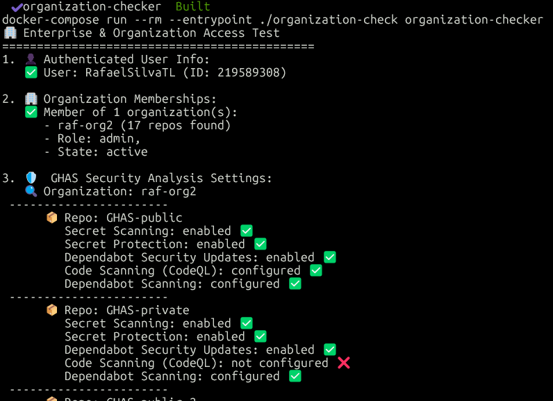

# GitHub Organization Security Analysis Tool

A Go application for analyzing GitHub organization-level security features and advanced security settings across all repositories in your organizations.

## 🚀 Features

1 - Analyze GHAS features across all repositories in your organization
2 - List allrepositories
3 - Create a Organization Security configuration template
4 - Update Security configuration
5 - Add repositories to the configuration
6 - Create a advanced filtered list of repositories

## 🛠️ Prerequisites

- Docker and Docker Compose
- GitHub Personal Access Token with appropriate permissions:
  - **`repo`** scope: For repository access
  - **`admin:org`** scope: For organization access (if needed)
  - **`security_events`** scope: For security feature analysis
  - Enterprise admin permissions (for enterprise features)

## ⚙️ Setup

1. **Clone the repository**:
   ```bash
   git clone <repository-url>
   cd go-scripts
   ```

2. **Set your GitHub token**:
   ```bash
   export GITHUB_TOKEN_ORG=your_github_token_here
   ```

3. **Initialize and build**:
   ```bash
   make build
   ```

## 🔧 Manual Usage (without Docker)

If you prefer to run the tool directly:

1. **Ensure you have Go installed** (version 1.23 or later).

2. **Install dependencies**:
   ```bash
   go mod tidy
   ```

3. **Set environment variable**:
   ```bash
   export GITHUB_TOKEN=your_github_token_here
   export GITHUB_ENDPOINT=GHEC  # or GHES for GitHub Enterprise Server
   export GHES_URL=https://your-ghes-domain/api/v3  # Only for GHES
   ```

## ORGANIZATION CHECK

   ```bash
   go run organization-check.go
   ```

## GET ORGANIZATION REPOSITORIES

   ```bash
   go run get_org_repos.go -org org-name -output workspace/repos.yaml
   ```
## ADVANCED FILTER

   ```bash
   # using isProduction filter only
   go run advanced_filter.go -org org-name

   # using isProduction for public repos only
   go run advanced_filter.go -org org-name -public-prod-outFile "{orgname}-prod-public.txt"
   ```

## CREATE SECURITY CONFIGURATION
   
   ```bash
   go run create_org_config.go -org org-name -yaml workspace/{org-name}.yaml
   ```

## UPDATE SECURITY CONFIGURATION

   ```bash
   go run update_org_config.go -org org-name -yaml workspace/{org-name}.yaml
   ```

## ADD REPOSITORIES TO CONFIGURATION

   ```bash
   # A single repository
   go run add_repo_to_config.go -org org-name -repo repo-name -config config-name

   # A specific repository
   go run add_repo_to_config.go -org org-name -repo "repo1,repo2,repo3" -config config-name

   # All repositories from a file
   go run add_repo_to_config.go -org org-name -repo repo-name -config config-name

   # All repositories
   go run add_repo_to_config.go -org org-name -repo all -config config-name
   ```


### Sample Output





## 🔗 Additional Resources

- [GitHub Advanced Security Documentation](https://docs.github.com/en/enterprise-cloud@latest/get-started/learning-about-github/about-github-advanced-security)
- [GitHub API Documentation](https://docs.github.com/en/rest)
- [Managing Security and Analysis Settings](https://docs.github.com/en/repositories/managing-your-repositorys-settings-and-features/enabling-features-for-your-repository/managing-security-and-analysis-settings-for-your-repository)
